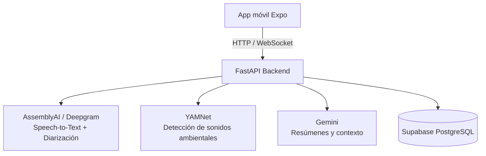

# SONARIA — Backend

Backend de **SONARIA**, un asistente ambiental con IA para personas con pérdida auditiva o sordera. Recibe audio en tiempo real desde la app móvil, transcribe la conversación distinguiendo quién habla (diarización) aunque todas las voces vengan del mismo micrófono, detecta sonidos del entorno (timbre, alarma, llanto de bebé, etc.) y genera resúmenes de contexto mediante IA.

*Proyecto desarrollado para el FLIT Hackathon 2026.*

## Arquitectura



- **Conversación en tiempo real:** audio → WebSocket → STT con diarización → se identifica el hablante → se guarda el mensaje → se envía el resultado a la app.
- **Sonidos ambientales:** audio → WebSocket → YAMNet clasifica el evento → se guarda → se notifica al usuario.
- **Resúmenes:** el usuario pregunta sobre su historial → se arma contexto desde Supabase → Gemini genera la respuesta.

## Stack

- **Framework:** FastAPI + Uvicorn (Python 3.12)
- **Base de datos:** Supabase (PostgreSQL) vía SQLAlchemy + Alembic
- **Auth:** JWT + bcrypt
- **Voz / audio:** AssemblyAI (streaming v3) y Deepgram SDK, procesamiento con numpy/scipy/soundfile
- **IA contextual:** Google Gemini (`google-genai`)
- **Tests:** pytest / pytest-asyncio

## Estructura

```
app/
├── main.py            # instancia FastAPI, routers, middleware
├── config.py          # variables de entorno
├── database.py        # conexión Supabase/PostgreSQL
├── routers/           # endpoints (auth, conversations, enrollment, events, sounds, voices, upload)
├── services/          # lógica de negocio + integración de IA (services/ai)
├── repositories/       # única capa que accede a la base de datos
├── models/            # modelos de base de datos (users, registered_voices, conversations, ...)
├── schemas/            # esquemas Pydantic de entrada/salida
└── websocket/          # streams de audio en tiempo real (audio_stream.py, sound_stream.py)
```

Regla del proyecto: los **routers** reciben peticiones, los **services** contienen la lógica, los **repositories** manejan la base de datos y los servicios de IA solo integran modelos — nunca se mezclan.

## Endpoints principales

| Método | Ruta | Descripción |
|---|---|---|
| POST | `/auth/register`, `/auth/login` | Registro y login de usuarios (JWT) |
| POST/GET/PUT/DELETE | `/voices` | Registro y gestión de voces conocidas |
| POST/GET | `/conversation/start`, `/conversation/history` | Sesiones de conversación |
| GET/POST | `/sounds` | Configuración de sonidos a monitorear |
| GET | `/events` | Eventos de sonido detectados |
| WS | `/ws/audio` | Streaming de audio de conversación |
| WS | `/ws/sounds` | Streaming de audio ambiental |

Documentación interactiva disponible en `/docs` (Swagger UI de FastAPI) una vez levantado el servidor.

## Cómo correrlo

```bash
cp .env.example .env   # completar DATABASE_URL, SUPABASE_URL/KEY, claves de IA, JWT_SECRET
docker compose up --build
```

El backend queda disponible en `http://localhost:8000` (docs en `http://localhost:8000/docs`).

## Estado

Prototipo funcional en desarrollo activo (MVP del hackathon): autenticación, conversaciones y sonidos implementados; resúmenes con Gemini y biometría de voz (torch/speechbrain) en roadmap.
