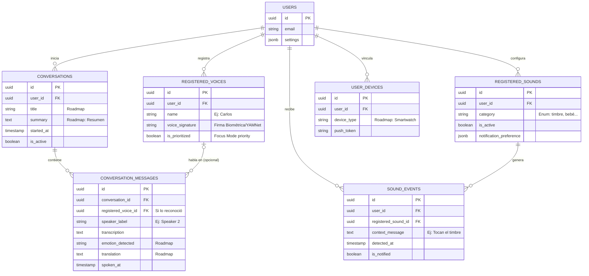

# Arquitectura de Base de Datos - Asistente Inclusivo (MVP & Roadmap)

Aplicando la skill de **database-architect**, he diseñado un esquema robusto (pensado para PostgreSQL/Supabase en la nube y adaptable a SQLite local). Este diseño cubre todas tus necesidades del MVP y deja las bases listas para el roadmap futuro.

## Diagrama Entidad-Relación (ERD)

Este diagrama muestra cómo se relacionan las entidades principales de la aplicación.



## Esquema SQL (DDL Optimizado)

El siguiente código SQL está optimizado para integridad referencial (uso estricto de Claves Foráneas) e índices en los campos más consultados (fechas, IDs).

```sql
-- ==============================================================================
-- 1. TIPOS DE DATOS Y ENUMERACIONES
-- ==============================================================================
CREATE TYPE sound_category AS ENUM (
    'doorbell', 'alarm', 'microwave', 'kettle', 'dog', 'baby_crying', 'custom'
);

-- ==============================================================================
-- 2. TABLAS PRINCIPALES (Plataforma)
-- ==============================================================================
CREATE TABLE users (
    id UUID PRIMARY KEY DEFAULT gen_random_uuid(),
    email VARCHAR(255) UNIQUE NOT NULL,
    created_at TIMESTAMP WITH TIME ZONE DEFAULT CURRENT_TIMESTAMP,
    updated_at TIMESTAMP WITH TIME ZONE DEFAULT CURRENT_TIMESTAMP,
    settings JSONB DEFAULT '{}'::jsonb -- Configuraciones globales del perfil
);

-- Roadmap: Dispositivos conectados (Smartwatch, IoT)
CREATE TABLE user_devices (
    id UUID PRIMARY KEY DEFAULT gen_random_uuid(),
    user_id UUID NOT NULL REFERENCES users(id) ON DELETE CASCADE,
    device_type VARCHAR(50), 
    push_token VARCHAR(255),
    registered_at TIMESTAMP WITH TIME ZONE DEFAULT CURRENT_TIMESTAMP
);

-- ==============================================================================
-- 3. FLUJO 1: ASISTENTE DE CONVERSACIÓN
-- ==============================================================================

-- Flujo 1.2 y 1.3: Registrar voces y Priorizar
CREATE TABLE registered_voices (
    id UUID PRIMARY KEY DEFAULT gen_random_uuid(),
    user_id UUID NOT NULL REFERENCES users(id) ON DELETE CASCADE,
    name VARCHAR(100) NOT NULL, -- Ej: "Carlos"
    voice_signature TEXT,       -- Referencia o embedding para YAMNet
    is_prioritized BOOLEAN DEFAULT FALSE, -- Flujo 1.4: Focus Mode (default priority)
    created_at TIMESTAMP WITH TIME ZONE DEFAULT CURRENT_TIMESTAMP,
    UNIQUE(user_id, name) -- Evitar nombres duplicados por usuario
);
CREATE INDEX idx_registered_voices_user ON registered_voices(user_id);

-- Contenedor de la sesión (Roadmap: Memoria, resúmenes)
CREATE TABLE conversations (
    id UUID PRIMARY KEY DEFAULT gen_random_uuid(),
    user_id UUID NOT NULL REFERENCES users(id) ON DELETE CASCADE,
    title VARCHAR(255),   -- Roadmap: Auto-generado al terminar
    summary TEXT,         -- Roadmap: Resumen automático de la charla
    started_at TIMESTAMP WITH TIME ZONE DEFAULT CURRENT_TIMESTAMP,
    ended_at TIMESTAMP WITH TIME ZONE,
    is_active BOOLEAN DEFAULT TRUE
);
CREATE INDEX idx_conversations_user ON conversations(user_id);
CREATE INDEX idx_conversations_active ON conversations(is_active);

-- Flujo 1.1: Separación de hablantes
CREATE TABLE conversation_messages (
    id UUID PRIMARY KEY DEFAULT gen_random_uuid(),
    conversation_id UUID NOT NULL REFERENCES conversations(id) ON DELETE CASCADE,
    registered_voice_id UUID REFERENCES registered_voices(id) ON DELETE SET NULL, -- Null si es desconocido
    speaker_label VARCHAR(50), -- Fallback: "Speaker 2", "Speaker 3"
    transcription TEXT NOT NULL,
    
    -- Escalabilidad (Roadmap)
    emotion_detected VARCHAR(50), 
    translation TEXT, 
    
    spoken_at TIMESTAMP WITH TIME ZONE DEFAULT CURRENT_TIMESTAMP
);
CREATE INDEX idx_messages_conversation ON conversation_messages(conversation_id);
CREATE INDEX idx_messages_spoken_at ON conversation_messages(spoken_at);

-- ==============================================================================
-- 4. FLUJO 2: ASISTENTE DE SONIDOS AMBIENTALES
-- ==============================================================================

-- Flujo 2.1: Registrar sonidos importantes
CREATE TABLE registered_sounds (
    id UUID PRIMARY KEY DEFAULT gen_random_uuid(),
    user_id UUID NOT NULL REFERENCES users(id) ON DELETE CASCADE,
    category sound_category NOT NULL,
    custom_name VARCHAR(100), -- Ej: "Timbre de puerta trasera"
    is_active BOOLEAN DEFAULT TRUE,
    notification_preference JSONB DEFAULT '{"vibration": true, "visual": true}'::jsonb,
    created_at TIMESTAMP WITH TIME ZONE DEFAULT CURRENT_TIMESTAMP
);
CREATE INDEX idx_registered_sounds_user ON registered_sounds(user_id);

-- Flujo 2.2 y 2.3: Detección y notificaciones en tiempo real
CREATE TABLE sound_events (
    id UUID PRIMARY KEY DEFAULT gen_random_uuid(),
    user_id UUID NOT NULL REFERENCES users(id) ON DELETE CASCADE,
    registered_sound_id UUID REFERENCES registered_sounds(id) ON DELETE CASCADE,
    context_message TEXT NOT NULL, -- Ej: "Alguien está tocando el timbre"
    detected_at TIMESTAMP WITH TIME ZONE DEFAULT CURRENT_TIMESTAMP,
    is_notified BOOLEAN DEFAULT FALSE -- Para evitar enviar notificaciones duplicadas
);
CREATE INDEX idx_sound_events_user ON sound_events(user_id);
CREATE INDEX idx_sound_events_detected ON sound_events(detected_at);
```

## Recomendaciones Arquitectónicas ("Bien macizas")

1. **Estrategia "Offline-First" (Vital para accesibilidad):** 
   Ya que la detección de audio requiere velocidad absoluta, te recomiendo usar **WatermelonDB** o **Expo SQLite** en la aplicación móvil para registrar todo en tiempo real.
2. **Sincronización en la Nube:**
   Cuando el celular tenga internet, sincroniza esta base de datos local hacia una base de datos en la nube (como **Supabase / PostgreSQL**) usando el `user_id`. Así logras el punto del Roadmap: *Compartir configuraciones entre dispositivos*.
3. **El Focus Mode (Flujo 1.4):**
   A nivel base de datos está cubierto por `is_prioritized` en la tabla `registered_voices`. A nivel UI, la app filtra la consulta de la tabla `conversation_messages` mostrando a full opacidad solo los mensajes cuyo `registered_voice_id` tenga el flag activado, y atenuando donde el ID no esté seleccionado.
